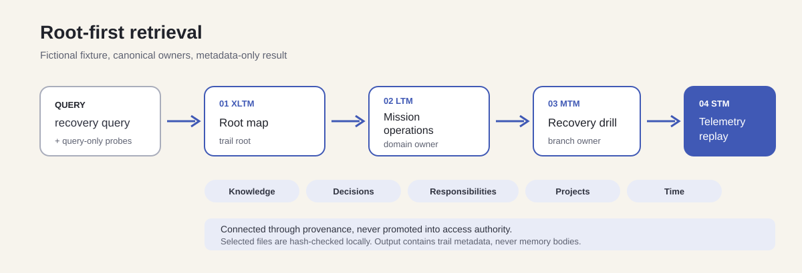
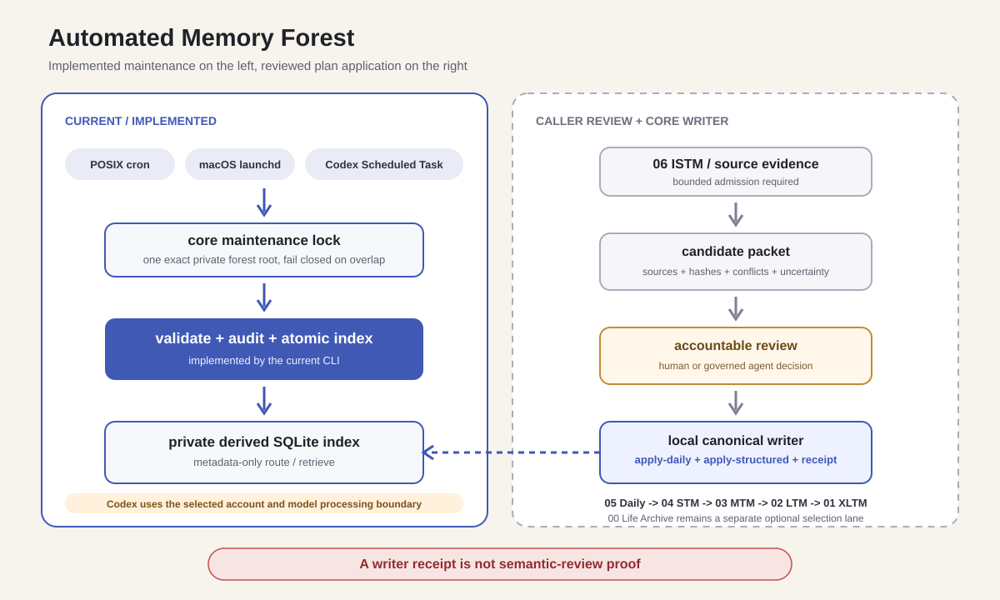

# Memory Forest

**오래 실행되는 AI agent를 위한, 검증 가능한 로컬 메모리 구조입니다.**

[English README](README.md)

Memory Forest는 기억을 번호가 붙은 파일 트리에 나눠 저장하고, 각 판단이 어디서 왔는지 추적할 수 있게 합니다. 정리된 기억은 Markdown으로, 원시 시간 기록은 제한된 JSONL로 보관합니다. SQLite index는 검색을 빠르게 하기 위한 파생 데이터라 언제든 다시 만들 수 있습니다.

> [!IMPORTANT]
> Memory Forest는 hosted service도, 권한 시스템도, AI가 정확히 기억한다는 보장도 아닙니다. 검색된 기억은 판단 근거일 뿐입니다. 실제 사용자는 원문을 열어 출처와 최신성, 충돌 여부를 확인하고 별도의 권한·안전 정책을 적용해야 합니다.

## 핵심 원칙

- **로컬 파일이 기준입니다.** 운영자가 지정한 filesystem이 원문과 provenance를 소유합니다.
- **본문보다 경로를 먼저 돌려줍니다.** 기본 검색은 상대 경로, 계층, 제목, 제한된 ranking metadata만 반환합니다.
- **선택된 후보를 root-first trail로 만듭니다.** `retrieve`는 bounded lexical match를 먼저 순위화한 뒤 `XLTM -> LTM -> MTM -> STM` 순서로 canonical owner를 구성합니다.
- **선택된 경로를 다시 검증합니다.** 결과를 내기 전에 현재 파일 hash와 index snapshot을 비교합니다.
- **promotion은 출처를 남깁니다.** 더 오래 보관할 요약도 그 근거가 된 source pointer를 유지합니다.
- **index는 지워도 됩니다.** 파생 상태를 삭제하거나 다시 만들어도 canonical memory는 바뀌지 않습니다.
- **기억은 권한이 아닙니다.** 파일 내용이나 QueryPlan은 tool permission이나 외부 행동을 승인할 수 없습니다.

## 구조

```text
06 ISTM  원시 chronology와 provenance
05 Daily 읽을 수 있는 최근 source 기록
04 STM   세부 evidence와 단기 실행 맥락
03 MTM   반복되는 branch와 중기 상태
02 LTM   오래 유지되는 domain tree
01 XLTM  root map과 장기 anchor
00 Life Archive  재사용할 수 있는 과거 기록
```

새 evidence는 `06 -> 05 -> 04 -> 03 -> 02 -> 01` 방향으로 정리됩니다. 검색은 structured index 전체에서 제한된 lexical match를 순위화한 다음, 선택된 후보를 `01 -> 02 -> 03 -> 04` 순서의 canonical trail로 펼칩니다. `00 life_archive`는 별도의 history archive이며 더 높은 truth 등급이 아닙니다.

이 연결 경로는 knowledge, 날짜가 있는 decision, 명시된 responsibility, project, 시간 provenance를 서로 떼어 놓지 않게 합니다. 다만 이런 관계가 access authority가 되는 것은 아닙니다. identity와 permission policy는 연결하는 application이 별도로 적용해야 합니다.




## 빠른 시작

Memory Forest v0.3는 macOS와 Linux의 POSIX filesystem을 대상으로 합니다. Python 3.11 이상이 필요하고 runtime dependency는 없습니다.

```sh
git clone https://github.com/hyungchulc/memory-forest.git
cd memory-forest
python3 -m venv .venv
. .venv/bin/activate
python -m pip install -e .
```

실제 기억 대신 공개 가능한 가상 fixture로 먼저 확인할 수 있습니다.

```sh
demo_parent="$(mktemp -d)"
demo_root="$(cd "$demo_parent" && pwd -P)/forest"
memory-forest init "$demo_root" --example
memory-forest doctor "$demo_root"
memory-forest validate "$demo_root"
memory-forest audit "$demo_root"
memory-forest index "$demo_root"
memory-forest route "$demo_root" "instrument calibration"
memory-forest retrieve "$demo_root" "telemetry replay"
```

`init`은 direct parent가 실제 directory로 존재하는 새 경로만 받습니다. 기존 파일, symlink, 빈 directory, 데이터가 있는 directory 위에는 초기화하지 않습니다.

### provenance가 고정된 로컬 쓰기

v0.3에는 network를 사용하지 않는 두 writer가 추가되었습니다.

```sh
chmod 600 daily-plan.json promotion-plan.json
memory-forest apply-daily "$demo_root" daily-plan.json
memory-forest promote "$demo_root" promotion-plan.json
```

`apply-daily`는 canonical Daily 파일만 쓰고, `promote`는 raw path가 아닌
semantic domain/branch/leaf route만 받습니다. Writer는 parent를 먼저 만들고,
인접 parent/child link를 갱신하며, STM leaf에 idempotent update block을
추가합니다. 처리 중 validation, audit, index가 실패하면 이전 canonical
파일과 index로 rollback합니다. Receipt는 세 검증이 모두 끝난 뒤에만
`.memory-forest/receipts/` 아래에 생성됩니다. 두 명령은 같은 sibling
maintenance lock을 직접 획득하고, `init`이 만든 private `forest_id`에
plan을 묶으므로 같은 경로의 forest가 교체되어도 실패하도록 닫혀 있습니다.
`forest_id`가 없는 기존 schema-v1 forest는 read-only validation과 retrieval은
계속 가능하지만, v0.3 writer는 지원되는 migration 전까지 거부하며 기존
configuration을 자동으로 고치지 않습니다.

정확한 형식은 [Daily Plan v1](docs/daily-plan.schema.json), [Promotion Plan
v1](docs/promotion-plan.schema.json), [Write Receipt
v1](docs/write-receipt.schema.json), [CLI reference](docs/cli.md)에 있습니다.

## root-first retrieve

```sh
memory-forest retrieve "$demo_root" "telemetry replay"
```

`retrieve`는 structured index 전체에서 bounded lexical match를 먼저 순위화한 뒤, 각 후보를 canonical owner 순서대로 root-first trail로 구성합니다. XLTM에서 시작해 단계별로 의미 검색을 좁히는 방식은 아닙니다. Lexical evidence가 XLTM에만 있으면 전체 forest로 무작정 펼치지 않고 depth 1의 partial trail을 냅니다.

완전한 결과는 다음 순서의 metadata trail을 냅니다.

```text
01 XLTM -> 02 LTM -> 03 MTM -> 04 STM
```

각 node에는 상대 경로, 계층, title, SHA-256, size, modification time이 들어갑니다. 본문은 들어가지 않습니다. `retrieve`는 선택된 파일을 로컬에서 다시 열어 hash만 확인한 뒤 본문을 버립니다. index를 만든 뒤 해당 파일이 바뀌었다면 `index_stale`로 중단하고 재색인을 요구합니다.

입력 경계부터 QueryPlan, deterministic 후보 순위, raw Daily/ISTM fallback,
body를 여는 시점, 외부 hybrid ranker의 책임까지는
[end-to-end retrieval guide](docs/retrieval-guide.md)에 자세히 설명되어 있습니다.
이 문서는 portable core 계약이며, 특정 application의 alias 규칙이나 hybrid
score를 core 동작으로 주장하지 않습니다.

## 영어·한국어와 다른 Unicode query

로컬 코어는 SQLite FTS5의 Unicode-aware lexical matching을 사용합니다. indexed content에 같은 표현이 있다면 영어, 한국어, Japanese, Arabic, accented Latin 등 여러 script를 직접 검색할 수 있습니다.

다른 언어의 표현이나 동의어까지 연결하려면 caller가 QueryPlan을 넘길 수 있습니다.

```json
{
  "schema_version": 1,
  "probes": [
    {"query": "mission recovery"},
    {"query": "telemetry replay"}
  ]
}
```

```sh
printf '%s' '{"schema_version":1,"probes":[{"query":"mission recovery"}]}' \
  | memory-forest retrieve "$demo_root" "비상 복원" --query-plan -
```

QueryPlan은 원래 query에 검색용 표현을 더할 뿐입니다. 원래 query가 직접 맞은 trail은 plan으로만 찾은 trail보다 항상 먼저 나옵니다. 각 probe에는 `query` 하나만 허용됩니다. path, memory body, token, credential, provider 설정, instruction, authorization field가 들어오면 거부합니다.

이 방식이 모든 언어를 의미적으로 이해한다는 뜻은 아닙니다. 띄어쓰기와 형태 변화, transliteration, dialect, indexed content의 범위, expansion을 만든 planner의 품질에 따라 recall이 달라집니다. 실제로 지원할 언어와 domain은 별도 fixture와 evaluation으로 확인해야 합니다.

## OAuth와 API 연결

Memory Forest core는 network request를 하지 않고 OAuth token도 받지 않습니다. OAuth/API gateway가 다음 경계를 소유합니다.

- user와 tenant 인증
- operation authorization
- opaque `forest_id`를 허용된 로컬 root로 연결하는 mapping
- OAuth token 검증, refresh, revocation, scope
- translation 또는 model API 호출
- rate limit, timeout, logging, retention
- 선택된 memory body를 나중에 열지 여부

gateway는 query만 외부 planner에 보내고, 돌아온 결과를 strict QueryPlan으로 검증한 뒤 로컬 `retrieve`에 전달할 수 있습니다. 자세한 계약은 [OAuth and API integration](docs/oauth-api-integration.md)과 [QueryPlan schema](docs/query-plan.schema.json)에 있습니다.

## route, search, retrieve의 차이

| 명령 | 결과 | 본문 |
|---|---|---|
| `route` | v0.1 호환 flat route candidate | 없음 |
| `search` | full-text candidate | 기본은 없음, `--include-body`로 명시 가능 |
| `retrieve` | 검증된 root-first structured trail | 항상 없음 |

v0.2 index schema는 `2`입니다. v0.1에서 만든 index는 canonical memory를 건드리지 않고 아래 명령으로 다시 만들면 됩니다.

```sh
memory-forest index ROOT
```

forest schema는 계속 version `1`이고, 기존 v0.1 `forest.json`, `route`, `search` 계약은 유지됩니다.

## privacy와 trust boundary

실제 forest와 index는 공개 Git repository 밖에 두어야 합니다. route metadata도 filename, domain, date, topic을 드러낼 수 있으므로 private context로 취급하는 편이 안전합니다.

memory text와 QueryPlan은 모두 untrusted data입니다. 삭제, 공개, 구매, account access, third-party send 같은 행동을 승인하지 못합니다. body를 model prompt에 넣는 순간부터는 해당 provider와 account의 retention, regional processing, organization policy가 적용됩니다.

실제 연결 전에는 [Privacy and trust](docs/privacy-and-trust.md), [PRIVACY.md](PRIVACY.md), [SECURITY.md](SECURITY.md)를 확인하세요.

## 매 turn 메모리 조회를 강제하는 방법

[Memory Forest Retrieve](docs/memory-forest-retrieve.md)는 비어 있지 않은
user-authored text turn마다 메모리를 먼저 조회해야 하는 assistant를 위한
별도 integration profile입니다.

예제 gate는 route와 retrieve를 모두 실행하고, 현재 turn에 묶을 수 있는
metadata-only receipt를 반환합니다. 검색 결과가 0개여도 조회 자체는 성공한
것으로 처리합니다. Prompt와 companion skill만으로는 실행을 강제할 수
없습니다. 실제 강제는 host가 response 생성 전에 gate를 등록하고, 그
turn의 성공 receipt가 없으면 정상 완료를 막는 방식으로 구현해야 합니다.

Gate는 자동 index, repair, 다른 root scan, body 반환, network 호출을 하지
않습니다. Route와 retrieve metadata도 비공개 untrusted data로 다뤄야
합니다.

## 함께 쓰는 프로젝트

Memory Forest는 canonical layer와 retrieval 계약을 맡고, source 수집과
retrieval 평가는 목적별 저장소로 분리합니다.

- [Codex Context for ISTM](https://github.com/hyungchulc/codex-context-for-istm)는
  로컬 Codex 대화를 ISTM으로 수집하고, 크기가 제한된 Daily digest와
  launchd 예제를 macOS에서 제공합니다.
- [Mac Context for ISTM](https://github.com/hyungchulc/mac-context-for-istm)는
  Apple Mail, Notification Center, Reminders, Calendar의 로컬 맥락을 별도
  비공개 ISTM으로 macOS에서 수집합니다.
- [Memory Retrieval Lab](https://github.com/hyungchulc/memory-retrieval-lab)은
  가상 fixture, 반복 가능한 지표, 다국어 사례, ranker adapter로 검색
  품질을 측정합니다.

이 프로젝트들의 기준 환경은 2026년 7월 24일 기준 GPT-5.6 Sol,
reasoning effort xhigh입니다. 수집과 deterministic baseline 자체는 model에
의존하지 않습니다. 저장소 경계와 Daily 크기 제한 계약은
[Daily and ISTM companion projects](docs/daily-and-istm-companions.md)에
정리되어 있습니다.

## 자동화

POSIX cron, macOS LaunchAgent, Codex Scheduled Task로 검증과 비공개 파생
index 재생성을 예약할 수 있습니다.



Core는 source system을 직접 수집하거나 semantic promotion을 판단하지
않습니다. 공개 starter는 그래서 두 lane을 분리합니다.

- 현재 구현된 deterministic maintenance는 하나의 정확한 비공개 root를
  잠근 뒤 validate, audit, atomic index rebuild를 수행합니다.
- integrator는 bounded source admission, conflict 처리, semantic review를
  거쳐 strict plan을 만들고, 구현된 `apply-daily` 또는 `promote` writer가
  lock, rollback, validate, audit, index, receipt를 담당합니다.

저장소에는 공통 maintenance wrapper, crontab 예제, 사용자용 macOS launchd
template, 범위를 제한한 Codex Scheduled Task prompt가 들어 있습니다.
사람이 지켜보지 않는 상태로 실행하기 전에
[Automation guide](docs/automation.md)를 읽으세요.

cron과 launchd는 로컬에서 끝낼 수 있습니다. 반면 Codex task는 선택한
account와 model processing boundary를 사용합니다. 외부 처리 없이 로컬에만
남겨야 하는 자료는 이 lane으로 보내면 안 됩니다.

## 현재 상태

Memory Forest는 alpha software입니다. v0.3는 deterministic local core,
root-first retrieval, strict write plan과 receipt, synthetic multiscript
fixture를 제공합니다. unattended high-stakes decision-making 용도로 완성된
제품은 아닙니다.

전체 검증은 다음 명령으로 실행합니다.

```sh
make check
```

## License

[MIT License](LICENSE)로 공개합니다.
