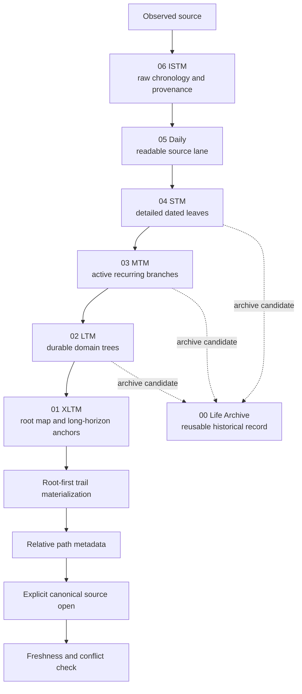

# Memory Forest

**A verifiable local memory architecture for long-running AI agents.**

[한국어 README](README.ko.md)

[](https://github.com/hyungchulc/memory-forest/actions/workflows/ci.yml)
[](https://www.python.org/)
[](LICENSE)
[](docs/privacy-and-trust.md)

Memory Forest organizes evidence into a numbered filesystem, preserves where claims came from, and returns routes before it returns memory bodies. Structured records stay human-readable in Markdown, while raw chronology can remain bounded JSONL. Local indexes are derived and replaceable.

> [!IMPORTANT]
> Memory Forest is not a hosted service, an authorization system, or a promise that an AI agent will remember correctly. Memory is grounding data. The caller must open the routed source, resolve conflicts, check freshness, and apply its own authority and safety rules.

## Why this exists

Long-running agents usually fail in one of two ways. They keep too little context, or they accumulate an unstructured pile that is difficult to retrieve and impossible to audit. Memory Forest separates source, lifespan, structure, promotion, and retrieval. Capture, readable evidence, working detail, durable knowledge, and long-horizon anchors remain connected by an inspectable provenance path.

The design is built around these properties.

- **Canonical local storage** - the operator-selected filesystem owns memory content and provenance, while indexes remain replaceable.
- **Route-first retrieval** - default queries return relative paths and bounded ranking metadata, not raw private bodies.
- **Root-first retrieval trails** - `retrieve` ranks bounded lexical matches, materializes each match through the canonical XLTM, LTM, MTM, and STM ownership chain, and returns a freshly hash-checked trail.
- **Provenance-preserving promotion** - a durable summary keeps a pointer to the evidence that justified it.
- **Rebuildable derived state** - indexes can be deleted and recreated without changing canonical memory.
- **Mechanical boundaries** - validators and audits check layer ownership, link direction, path safety, and common public-release mistakes.

The tree is canonical because ownership should be deterministic. Wikilinks preserve the evidence path between adjacent layers. Similarity edges, graph communities, embeddings, and visualizations can still be generated, but they remain disposable derived state instead of silently redefining where a memory belongs.

This connected trail can keep knowledge, dated decisions, explicit responsibilities, projects, and time-bound provenance related without turning those relationships into access authority. Identity and permission policy stay with the integrating application.

## Architecture



Capture moves upward from recent evidence toward durable structure. The v0.2 `retrieve` command globally ranks bounded lexical evidence, then materializes each candidate in root-first canonical ownership order. It reopens the selected files, verifies their indexed hashes, and returns metadata-only trails. This is not a staged top-down semantic traversal. An XLTM-only lexical match remains a depth-one partial trail instead of fanning out across the whole forest. The existing `route` and `search` commands retain their v0.1 flat-query behavior and JSON boundary. `00 life_archive` is a side archive for reusable history, not a higher truth rank.


See [Architecture](docs/architecture.md) and [Layer contracts](docs/layers.md) for the full model.

## Layer map

| Layer | Object | Responsibility |
|---|---|---|
| `00 life_archive` | archive record | reusable project or life history with retained provenance |
| `01 xltm` | root map | top-level domains, long-horizon anchors, cross-domain invariants |
| `02 ltm` | domain tree | durable knowledge and stable domain contracts |
| `03 mtm` | branch | active recurring work, procedures, and medium-horizon state |
| `04 stm` | leaf | detailed dated evidence and short-term actionable context |
| `05 daily` | daily source | readable, source-bound digest of recent events |
| `06 istm` | raw source | append-oriented chronology and provenance records |

Layer placement is a responsibility decision, not a confidence score. A claim in XLTM can still be stale or wrong.

## Quick start

Memory Forest is currently an alpha reference implementation for macOS and Linux. It requires Python 3.11 or newer, a POSIX filesystem with Unix permission modes, and no required runtime dependencies outside the standard library.

```sh
git clone https://github.com/hyungchulc/memory-forest.git
cd memory-forest
python3 -m venv .venv
. .venv/bin/activate
python -m pip install -e .
```

Create a private synthetic demo with strict runtime permissions, then inspect and query it.

`init` accepts only a new path whose direct parent already exists as a real, non-symlink directory. It never creates missing ancestor directories and refuses every existing target.

```sh
demo_parent="$(mktemp -d)"
demo_root="$(cd "$demo_parent" && pwd -P)/forest"
memory-forest init "$demo_root" --example
memory-forest doctor "$demo_root"
memory-forest validate "$demo_root"
memory-forest audit "$demo_root"
memory-forest index "$demo_root"
memory-forest route "$demo_root" "instrument calibration"
memory-forest search "$demo_root" "reference lamp"
memory-forest retrieve "$demo_root" "telemetry replay"
```

Search is metadata-only by default and queries the last built index snapshot. Reading matching bodies is an explicit operation. When a selected canonical file has changed since indexing, body retrieval fails with `index_stale` instead of returning cached text. Rebuild the index after forest changes.

```sh
memory-forest search "$demo_root" "reference lamp" --include-body
```

### Query expansion without putting a model in the core

The local core does not call a translation, embedding, or model API. A caller may supply a strict QueryPlan containing query strings only. This allows an OAuth-authenticated gateway to expand a Korean, English, mixed-language, or other Unicode query while keeping tokens, filesystem roots, memory bodies, and authorization outside the plan.

```json
{
  "schema_version": 1,
  "probes": [
    {"query": "mission recovery"},
    {"query": "telemetry replay"}
  ]
}
```

```sh
printf '%s' '{"schema_version":1,"probes":[{"query":"mission recovery"}]}' \
  | memory-forest retrieve "$demo_root" "비상 복원" --query-plan -
```

Every probe object must contain exactly one `query` field. Paths, bodies, tokens, credentials, provider settings, and all other fields are rejected. The original query is always retained. A trail with direct original-query evidence always ranks ahead of a plan-only trail; accepted probes add recall and ranking evidence only within that boundary. The expansion quality is owned by the caller; SQLite Unicode tokenization and supplied probes do not guarantee semantic retrieval for every language.

See [OAuth and API integration](docs/oauth-api-integration.md), the [QueryPlan schema](docs/query-plan.schema.json), and the [CLI reference](docs/cli.md).

The tracked [synthetic forest](examples/synthetic-forest/INDEX.md) is a human-readable reference. Git does not preserve the private `0700` directory and `0600` file modes required of a runnable forest, so use `init --example` rather than validating the checkout fixture in place. `pwd -P` resolves platform temp-directory aliases before the CLI applies its no-symlink boundary. Remove the temporary demo when you are finished.

See the [CLI reference](docs/cli.md) before integrating the output into another process.

## Route-only privacy boundary

The default retrieval boundary is deliberately narrow.

1. A query is evaluated against an exact local forest root and its private derived index.
2. The tool returns bounded route metadata such as layer, relative path, title, and score.
3. `retrieve` reopens only the selected trail files to verify current hashes, then discards their bodies before emitting JSON.
4. The caller separately chooses whether to open a canonical body.
5. Any opened body is handled under the caller's own model, account, retention, and privacy controls.

The route result is not source truth and does not grant permission. A local SQLite index should be protected like the source forest because it may contain derived text or tokens.

Read [Privacy and trust](docs/privacy-and-trust.md), [PRIVACY.md](PRIVACY.md), and [SECURITY.md](SECURITY.md) before connecting a real forest to an agent.

## Provenance and promotion

Promotion is an adjacent-layer, evidence-preserving operation.

```text
06 ISTM -> 05 Daily -> 04 STM -> 03 MTM -> 02 LTM -> 01 XLTM
                         \-------- 00 Life Archive candidate --------/
```

A promoted record should carry the source pointer, source and capture times, scope, observed fact, derived conclusion, uncertainty, destination, and reason. Promotion does not make a claim true. Mutable facts still require current verification.

The Life Archive arrows above represent selection from structured history, not unrestricted canonical wikilinks. In the current schema, Life Archive links canonically only to adjacent XLTM; nonadjacent evidence remains a plain provenance path.

The reference contracts use parent-first materialization and adjacent-layer links. `audit` requires every LTM, MTM, and STM record to link to its immediate canonical parent. Same-layer lateral wikilinks are rejected so ownership remains mechanically inspectable.

See [Provenance and promotion](docs/provenance-and-promotion.md).

## Relationship to Codex Debug Bridge

[Codex Debug Bridge](https://github.com/hyungchulc/codex-debug-bridge) includes a small `memory-forest-starter` as an onboarding path for a private route-only helper. This repository is the standalone portable reference implementation. It adds the CLI, contracts, audits, synthetic example, documentation, and companion skill.

Neither project contains a real private forest. Neither project includes private prompts, production ranking and promotion automation, operational logs, personal adapters, or user identifiers. The projects can be used independently.

See [Codex Debug Bridge integration](docs/codex-debug-bridge.md).

## Project status

Memory Forest is alpha software. The v0.2 scope adds deterministic root-first retrieval and a constrained integration protocol to the local core, portable contracts, synthetic fixtures, and route-first body boundary. It is suitable for evaluation and adaptation, not unattended high-stakes decision-making.

Candidate directions include measured multilingual routing evaluation, optional ranking adapters, generated graph views, migration tooling, and stronger provenance integrity checks. These are not release promises. See [Roadmap](docs/roadmap.md).

## Repository map

| Path | Purpose |
|---|---|
| `src/memory_forest/` | local CLI and reference implementation |
| `docs/` | architecture, contracts, privacy boundary, and integration guidance |
| `examples/synthetic-forest/` | fictional 00-06 forest with no private identifiers |
| `skills/memory-forest/` | companion Codex skill |
| `tests/` | behavior and regression tests |
| `scripts/audit_public_release.py` | public-tree secret and identifier audit |

## Contributing

Read [CONTRIBUTING.md](CONTRIBUTING.md). Keep fixtures synthetic, keep real forests outside Git, and run the full local check before opening a pull request.

```sh
make check
```

Security issues should follow [SECURITY.md](SECURITY.md). Community participation follows [CODE_OF_CONDUCT.md](CODE_OF_CONDUCT.md).

## License

Memory Forest is released under the [MIT License](LICENSE).
