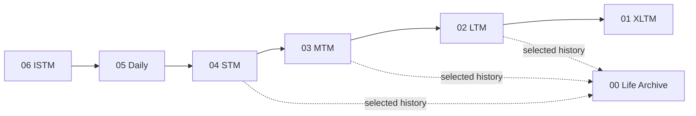
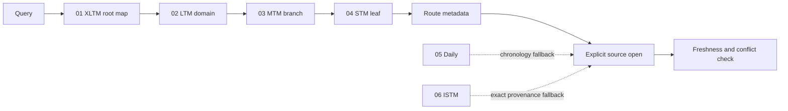
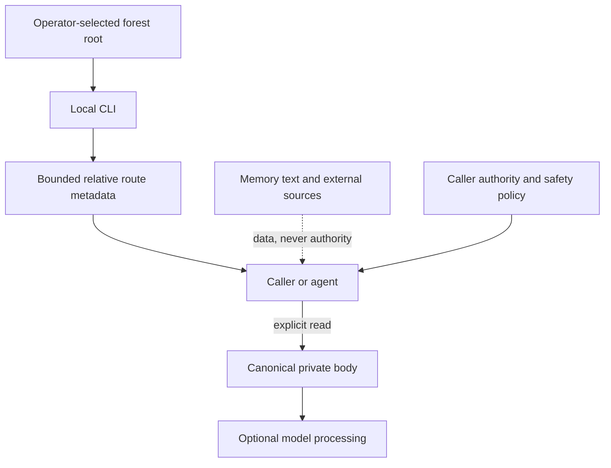

# Architecture

Memory Forest is a filesystem architecture with a local derived index. Canonical Markdown and provenance records are authoritative. The index exists to make routing fast and can be rebuilt.

## Two directions

The same forest supports two different flows.

### Capture and promotion

New evidence enters at the source side. Each promotion asks whether the information has a clearer durable owner and is likely to be reused. Promotion is consolidation with provenance, not blind duplication.

### Retrieval and verification

In the full method, retrieval begins with the root map, narrows to the smallest relevant branch or leaf, and returns a route. Daily and ISTM are chronology and provenance fallbacks when a structured record is not enough.

The v0.1 reference CLI does not execute that hierarchy traversal. Its `route` command performs a bounded flat FTS query over indexed relative paths and titles, then returns candidate metadata without bodies. A caller that needs root-first reasoning must open and follow the routed canonical owners explicitly.

## Canonical and derived state

| State | Role | Recovery model |
|---|---|---|
| numbered forest files | canonical content and provenance | back up as private source data |
| wikilinks and parent paths | canonical ownership graph | validate mechanically |
| SQLite index | point-in-time derived search snapshot | delete and rebuild after canonical changes |
| route result | transient candidate metadata | recompute from current forest |
| opened body | explicit canonical read with indexed-hash check | handle under caller privacy controls |

An index must never become the only copy of a memory claim. Index failure must not rewrite canonical files.

## Why the forest is canonical

A graph is useful for discovery, but it is a weak ownership model when every relationship can become an equal edge. Memory Forest keeps one inspectable parent chain as canonical so a maintainer can answer three mechanical questions without a model.

1. Which layer owns this record?
2. Which domain and branch own this leaf?
3. Which adjacent evidence justified its promotion?

Wikilinks make that parent and provenance chain navigable. The v0.1 audit requires each LTM, MTM, and STM document to link to its immediate canonical parent. A derived graph can add lateral similarity, clusters, centrality, or visual navigation without changing the source hierarchy. Delete the graph or index and the canonical forest still explains itself.

## Object ownership

The structured layers use a simple ontology.

- XLTM owns the root map and top-level domain set.
- LTM owns domain trees.
- MTM owns recurring branches.
- STM owns detailed leaves.
- Daily owns readable recent source records.
- ISTM owns raw chronology and provenance.
- Life Archive owns selected reusable history without replacing the temporal ladder.

New children are materialized parent-first. A leaf should not appear before its branch and domain owners exist. This makes invalid structure detectable without an AI model.

## Link contract

The reference contract keeps canonical structured links adjacent.

| From | Allowed canonical links |
|---|---|
| STM | MTM |
| MTM | STM and LTM |
| LTM | MTM and XLTM |
| XLTM | LTM |
| Life Archive | XLTM |

Life Archive may retain nonadjacent source paths as plain provenance fields, but its canonical wikilinks follow the same numeric adjacency rule and therefore connect only to XLTM in v0.1. Same-layer lateral links are intentionally avoided in canonical memory. Lateral similarity, graph communities, and experimental relationships belong in rebuildable derived state where they cannot silently change source ownership.

## Trust boundaries

Memory content can be wrong, stale, malicious, or prompt-injected. It is always data. It cannot grant permission, change tool policy, or override the current user request.

The CLI's normal operation is local and network-free. An external caller may still send explicitly opened content to a model. That external processing is outside the local filesystem boundary and must be governed separately.

## Failure posture

The portable core is designed to fail closed around structure and paths.

- Reject a forest root that is not the selected real directory.
- Reject symlink traversal and paths that escape the root.
- Refuse initialization over every existing target.
- Return route candidates as candidates, not verified facts.
- Keep body inclusion explicit.
- Preserve conflicts and uncertainty instead of silently overwriting them.
- Treat audit or validation failure as a reason to stop automation, not as permission to repair content automatically.

The v0.1 filesystem implementation targets macOS and Linux. Its private-mode checks rely on POSIX `0700` directories and `0600` files; Windows ACL behavior is outside this release.

## Scope boundary

This repository publishes the portable method, CLI, contracts, audits, synthetic example, and companion skill. It does not publish a private production forest, private prompts, private route aliases, user profiles, operational logs, production ranking and promotion automation, or service connectors.
