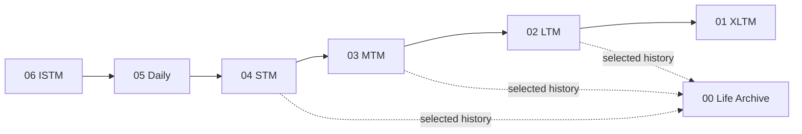
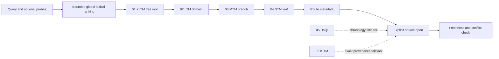
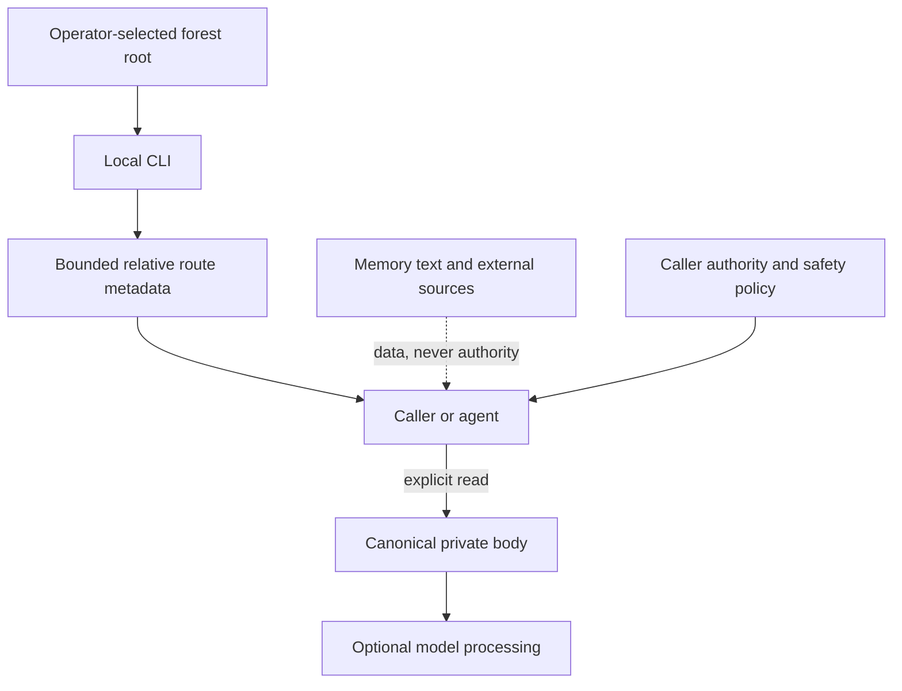

# Architecture

Memory Forest is a filesystem architecture with a local derived index. Canonical Markdown and provenance records are authoritative. The index exists to make routing fast and can be rebuilt.

## Two directions

The same forest supports two different flows.

### Capture and promotion

New evidence enters at the source side. Each promotion asks whether the information has a clearer durable owner and is likely to be reused. Promotion is consolidation with provenance, not blind duplication.

### Retrieval and verification

Retrieval globally ranks bounded lexical matches, then materializes each selected match from the root map down to the smallest canonical owner. Daily and ISTM are chronology and provenance fallbacks when a structured record is not enough.

The core never performs that fallback implicitly: `retrieve` indexes and ranks
only XLTM through STM. A caller may explicitly open a bounded Daily or ISTM
source after it has inspected the structured route and applied its own
authorization, freshness, and privacy policy. See the [end-to-end retrieval
guide](retrieval-guide.md) for the query, body, conflict, and external-ranker
boundaries.

The v0.2 `retrieve` operation implements the structured part of this method. Literal matches from the original query and optional validated probes are aggregated into root, domain, branch, and leaf evidence. A trail containing direct original-query evidence always ranks ahead of a plan-only trail. Probes can expand recall and influence ordering within that trust boundary, but cannot override an explicit direct match. Candidate selection is then materialized in canonical order from XLTM through LTM and MTM to STM. An XLTM-only match stays root-only rather than expanding across every domain. A domain or branch with no deeper owner can also produce a partial trail; a complete trail ends at STM. Selected files are reopened and hash-checked before metadata is emitted. Bodies are discarded and never included in `retrieve` output.

`route` remains the v0.1-compatible bounded flat FTS query over relative paths and titles. `search` retains its separate explicit body boundary.

## Canonical and derived state

| State | Role | Recovery model |
|---|---|---|
| numbered forest files | canonical content and provenance | back up as private source data |
| wikilinks and parent paths | canonical ownership graph | validate mechanically |
| SQLite index | point-in-time derived search snapshot | delete and rebuild after canonical changes |
| route result | transient candidate metadata | recompute from current forest |
| root-first trail | transient, hash-validated ownership metadata | recompute from the current index and canonical files |
| opened body | explicit canonical read with indexed-hash check | handle under caller privacy controls |

An index must never become the only copy of a memory claim. Index failure must not rewrite canonical files.

## Why the forest is canonical

A graph is useful for discovery, but it is a weak ownership model when every relationship can become an equal edge. Memory Forest keeps one inspectable parent chain as canonical so a maintainer can answer three mechanical questions without a model.

1. Which layer owns this record?
2. Which domain and branch own this leaf?
3. Which adjacent evidence justified its promotion?

Wikilinks make that parent and provenance chain navigable. The audit requires each LTM, MTM, and STM document to link to its immediate canonical parent. A derived graph can add lateral similarity, clusters, centrality, or visual navigation without changing the source hierarchy. Delete the graph or index and the canonical forest still explains itself.

## Object ownership

The structured layers use a simple ontology.

- XLTM owns the root map and top-level domain set.
- LTM owns domain trees.
- MTM owns recurring branches.
- STM owns detailed leaves.
- Daily owns readable recent source records.
- ISTM owns raw chronology and provenance.
- Life Archive owns selected reusable history without replacing the temporal ladder.

New children are materialized parent-first. A leaf should not appear before its branch and domain owners exist. This makes invalid structure detectable without an AI model.

## Connected memory without flattened authority

The canonical trail is deliberately small, but it can preserve connections that matter to an institutional memory system.

- knowledge remains attached to the evidence and domain that own it
- decisions can remain dated and linked to the source record that justified them
- owners and responsibilities can be referenced as explicit data without becoming access authority
- projects can retain their domain, branch, and leaf context instead of becoming isolated summaries
- time remains recoverable through Daily and ISTM provenance when the structured trail is not enough

Index schema 2 stores each structured document's canonical parent path. The v0.2 result validates those edges and makes the canonical parent-child relationships explicit by index within each returned trail. It does not extract people, infer responsibility, build a hidden organizational profile, or decide access. Richer similarity or relationship graphs remain optional derived state. Permission filtering and identity policy belong to the integrating application and must run before a private body is opened.

## Link contract

The reference contract keeps canonical structured links adjacent.

| From | Allowed canonical links |
|---|---|
| STM | MTM |
| MTM | STM and LTM |
| LTM | MTM and XLTM |
| XLTM | LTM |
| Life Archive | XLTM |

Life Archive may retain nonadjacent source paths as plain provenance fields, but its canonical wikilinks follow the same numeric adjacency rule and therefore connect only to XLTM in the current schema. Same-layer lateral links are intentionally avoided in canonical memory. Lateral similarity, graph communities, and experimental relationships belong in rebuildable derived state where they cannot silently change source ownership.

## Query expansion boundary

The deterministic core does not translate, embed, or call a model. It accepts an optional versioned QueryPlan from a caller. The plan may contain only bounded query strings. Paths, bodies, credentials, provider settings, and instructions are not part of the protocol.

An OAuth or API gateway can generate or obtain those probes, but it remains responsible for identity, authorization, root selection, tokens, network calls, model policy, and retention. The core validates the plan as untrusted data and uses accepted probes only as additive lexical evidence. See [OAuth and API integration](oauth-api-integration.md).

Embeddings, aliases, semantic expansion, hybrid candidate fusion, and external
reranking are likewise integration choices, not core behavior. They may add
recall or ranking evidence outside the deterministic route contract but cannot
change canonical parent ownership or bypass the explicit body boundary.

This design can improve cross-language recall when useful translations or variants are supplied. It does not imply universal language understanding. SQLite tokenization, content coverage, morphology, and planner quality remain measurable limits.

## Trust boundaries

Memory content can be wrong, stale, malicious, or prompt-injected. It is always data. It cannot grant permission, change tool policy, or override the current user request.

The CLI's normal operation is local and network-free. An external caller may still send explicitly opened content to a model. That external processing is outside the local filesystem boundary and must be governed separately.

## Failure posture

The portable core is designed to fail closed around structure and paths.

- Reject a forest root that is not the selected real directory.
- Reject symlink traversal and paths that escape the root.
- Refuse initialization over every existing target.
- Return route candidates as candidates, not verified facts.
- Keep body inclusion explicit.
- Preserve conflicts and uncertainty instead of silently overwriting them.
- Treat audit or validation failure as a reason to stop automation, not as permission to repair content automatically.

The v0.2 filesystem implementation targets macOS and Linux. Its private-mode checks rely on POSIX `0700` directories and `0600` files; Windows ACL behavior is outside this release.

## Scope boundary

This repository publishes the portable method, CLI, contracts, audits, synthetic example, and companion skill. It does not publish a private production forest, private prompts, private route aliases, user profiles, operational logs, production ranking and promotion automation, or service connectors.
