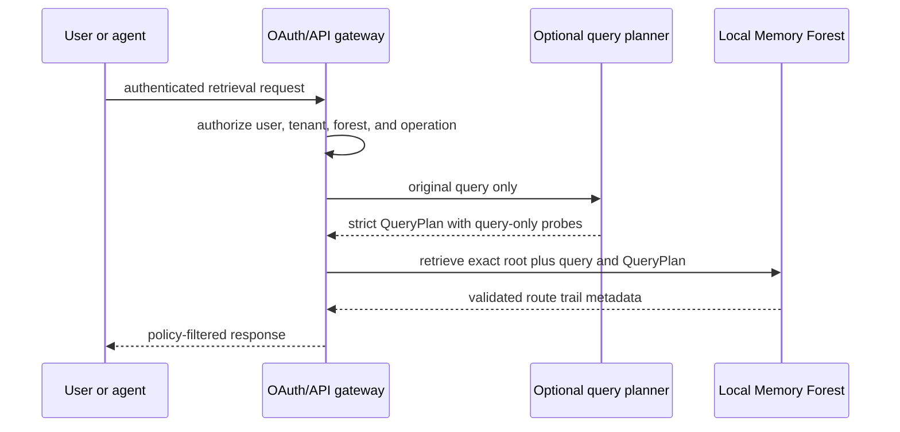

# OAuth and API integration

Memory Forest keeps OAuth, HTTP, provider SDKs, and network access outside the local core. An application gateway owns identity and authorization, maps an opaque tenant or forest identifier to one operator-approved local root, and invokes the CLI with bounded input.

This separation is intentional. A model-generated query expansion is untrusted data. QueryPlan has no path, body, credential, or authorization field, and the core never interprets query text as any of those. A gateway must still prevent secrets, private paths, or operational instructions from being copied into an allowed `query` string.

## Boundary



The gateway, not the QueryPlan, owns all of the following.

- OAuth 2.0 or OpenID Connect login, callback handling, token validation, refresh, revocation, and scope checks
- tenant and user identity
- the mapping from an opaque application identifier to an exact local forest root
- operation policy, rate limits, timeouts, logging, retention, and response filtering
- any outbound model or translation API call
- any later decision to open a selected canonical memory body

The local core accepts none of those fields and performs no network request.

## QueryPlan protocol

A QueryPlan is additive. The original query is always evaluated, and a trail with direct original-query evidence always ranks ahead of a plan-only trail. Each accepted probe supplies another literal Unicode query that can express a translation, spelling variant, synonym, or domain term. A probe equal to the original query is accepted but removed as ineffective before retrieval; result metadata reports accepted and effective counts separately.

```json
{
  "schema_version": 1,
  "probes": [
    {"query": "mission recovery"},
    {"query": "telemetry replay"}
  ]
}
```

The protocol is closed.

- The top level contains exactly `schema_version` and `probes`.
- Every probe contains exactly one `query` string.
- Unknown fields are rejected, including path, body, credential, provider, model, tool, instruction, and authorization fields.
- Strings must be trimmed NFC Unicode text without control characters.
- Probe queries must be unique under Unicode case folding.
- The document is limited to 32,768 UTF-8 bytes.
- The default limit is 8 probes. A forest may lower or raise it to at most 16 through the optional local retrieval configuration.
- Duplicate JSON object keys, non-finite numbers, unsupported schema versions, and malformed UTF-8 fail closed.

The machine-readable shape is in [query-plan.schema.json](query-plan.schema.json). Schema validation is a structural precheck, not sufficient acceptance proof. The CLI additionally requires `schema_version` to arrive as the exact JSON integer token `1`, so `1.0` is rejected even though some JSON Schema validators treat it as the same mathematical integer. The CLI also performs normalization, control and surrogate rejection, uniqueness, byte-size, and configured-limit checks.

## Local invocation

Prefer standard input so the plan does not need to persist on disk.

```sh
printf '%s' '{"schema_version":1,"probes":[{"query":"mission recovery"}]}' \
  | memory-forest retrieve "$forest_root" "비상 복원" --query-plan -
```

A regular non-symlink JSON file is also accepted.

```sh
memory-forest retrieve "$forest_root" "비상 복원" --query-plan query-plan.json
```

The CLI emits one JSON object. It returns a bounded root-first trail and selected-file hashes, sizes, titles, and relative routes. It does not return memory bodies. It reopens each selected canonical file and rejects a stale index before emitting the result.

## Optional forest configuration

The v0.1 configuration remains valid. An operator may add only this retrieval block.

```json
{
  "layout": "layer/domain/branch/leaf",
  "layers": [
    "00 life_archive",
    "01 xltm",
    "02 ltm",
    "03 mtm",
    "04 stm",
    "05 daily",
    "06 istm"
  ],
  "retrieval": {
    "query_plan": {
      "max_probes": 8
    }
  },
  "schema_version": 1
}
```

Do not put endpoints, provider names, client identifiers, tokens, secrets, scopes, user identifiers, or root paths in this file. Those belong to the caller or gateway.

The raw configuration must use strict JSON with unique object keys and finite bounded numbers. `schema_version` must be the exact JSON integer token `1`; booleans and floating-point forms such as `1.0` are rejected.

## Example HTTP wrapper contract

An HTTP service can expose its own versioned request while keeping the local QueryPlan nested and unchanged.

```json
{
  "forest_id": "fictional-demo",
  "query": "비상 복원",
  "query_plan": {
    "schema_version": 1,
    "probes": [
      {"query": "mission recovery"}
    ]
  }
}
```

`forest_id` is resolved and authorized by the gateway. It is never forwarded as a path or added to the QueryPlan. Authentication belongs in the HTTP layer, outside the JSON plan.

## Language boundary

Memory Forest uses SQLite FTS5 with Unicode-aware lexical tokenization. Direct matching works for many Unicode strings represented in indexed content. QueryPlan probes can bridge languages when the caller supplies useful translations or variants. Neither mechanism is a universal semantic-language layer. Segmentation, morphology, transliteration, dialect, sparse content, and planner quality can all limit recall.

Evaluate the languages and domains you actually serve with synthetic or consented fixtures. Keep a deterministic no-plan query as the baseline, record planner provenance in the gateway, and never treat expansion confidence as authorization or factual confidence.
