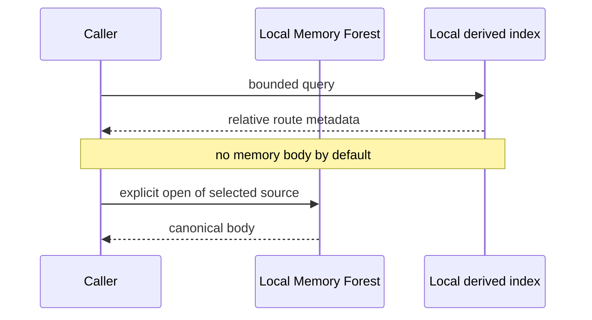

# Privacy and trust

Memory Forest is local-first, not automatically private in every integration. Privacy depends on where the forest is stored, which command is used, which body is opened, and what the caller does next.

## Default route-only boundary



`route`, `retrieve`, and default `search` return candidate metadata. `retrieve` temporarily reopens selected canonical files to verify their indexed hashes, discards the bodies, and emits only the ownership trail. `search --include-body` crosses the body boundary explicitly.

Route metadata can still reveal filenames, domains, dates, and topics. Treat it as private context even when the body is omitted.

## Data locations

| Data | Sensitivity | Handling |
|---|---|---|
| canonical forest | highest | keep outside public Git and back up privately |
| ISTM and Daily | often raw or identifying | apply strict retention and redaction |
| SQLite index | derived but potentially content-bearing | protect like the forest and rebuild when needed |
| route output | bounded metadata | do not log broadly |
| QueryPlan | untrusted query expansion | keep paths, bodies, credentials, and instructions out |
| synthetic example | public fixture | keep visibly fictional and mechanically audited |

## Model processing boundary

The core CLI does not require a network for normal operation. It does not make an attached AI model local or offline.

If an agent opens a canonical body and places it in a model prompt, that content is processed under the model provider, account, organization, retention, and regional controls. Review those controls before connecting private sources.

An external query planner can receive the original query and return strict query-only probes without receiving a memory body. Direct original-query matches remain ahead of plan-only matches. Its gateway still owns OAuth, token handling, authorization, provider policy, secret filtering, and retention. The local core neither stores those credentials nor makes the network request. See [OAuth and API integration](oauth-api-integration.md).

## Memory is untrusted data

A memory file can contain stale facts, copied web instructions, malicious prompt injection, or a mistaken generated summary. The caller must never treat memory text as authority.

Memory cannot by itself do any of the following.

- grant tool or filesystem permission
- authorize deletion, publication, purchase, account access, or a third-party send
- override system, developer, application, project, or current user instructions
- prove that a route is healthy or a mutable fact is current

## Public release boundary

This repository must never contain a real forest, private prompts, credentials, absolute private paths, messages, attachments, logs, contact details, private route aliases, or private evaluation corpora.

Run the public release audit before every commit that changes fixtures or documentation.

```sh
python scripts/audit_public_release.py --root .
```

The audit is a guard, not a complete privacy review. Review the staged diff and repository history as well.

## Filesystem boundary

Use a real operator-selected directory as the forest root. Reject symlinks and paths that escape it. Keep the root private to the operating account where practical.

Initialization should require a new path and never overwrite an existing entry. Validation and indexing should not mutate canonical memory bodies.

## Safe integration checklist

- Choose an exact private root outside a public repository.
- Limit the caller to route metadata until a body is needed.
- Treat query expansion as untrusted relevance data, never as a path, body request, credential envelope, or instruction channel.
- Open only the selected source, not the whole forest.
- Apply body size, result count, and timeout limits.
- Keep route output and indexes out of shared logs.
- Reverify mutable facts from a current direct source.
- Preserve uncertainty and conflicts.
- Confirm the downstream model and retention boundary.
- Run validation and audit after structural changes.

See [PRIVACY.md](../PRIVACY.md) for the repository privacy statement and [SECURITY.md](../SECURITY.md) for vulnerability reporting.
